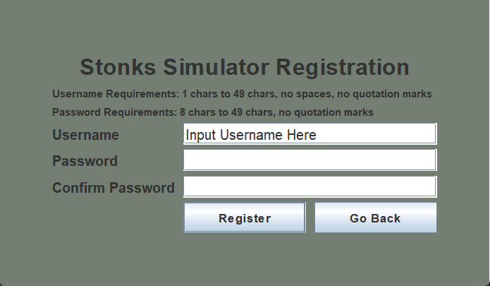
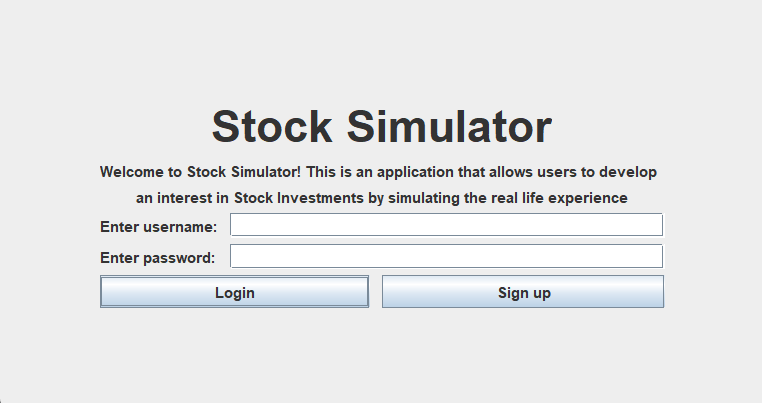
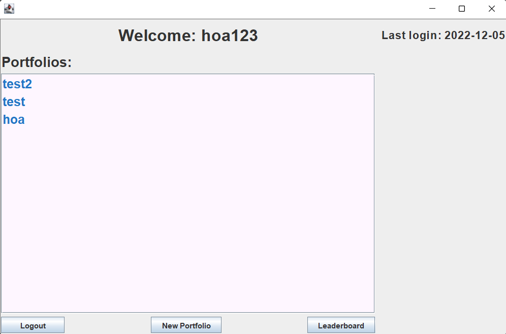
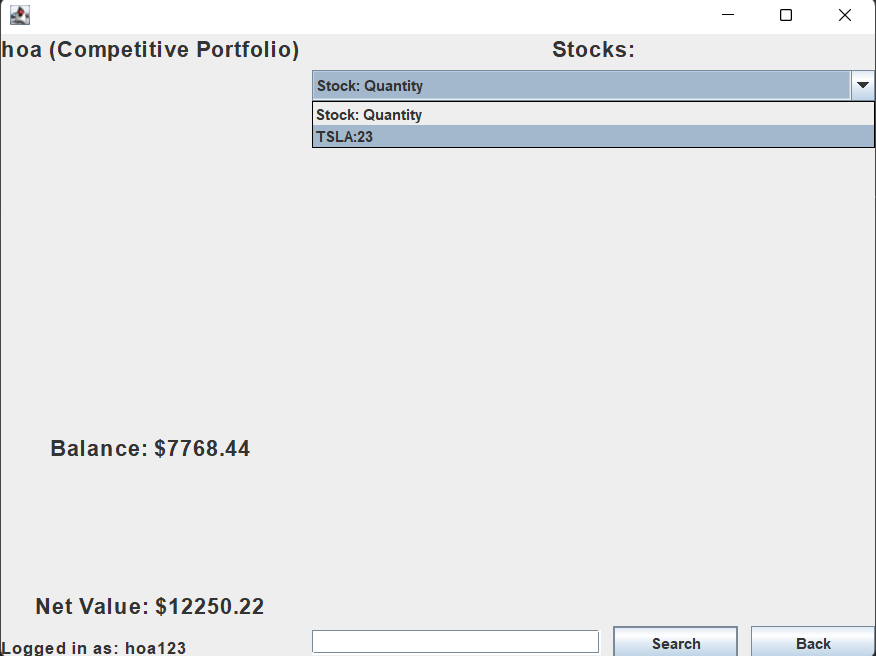
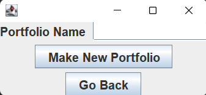
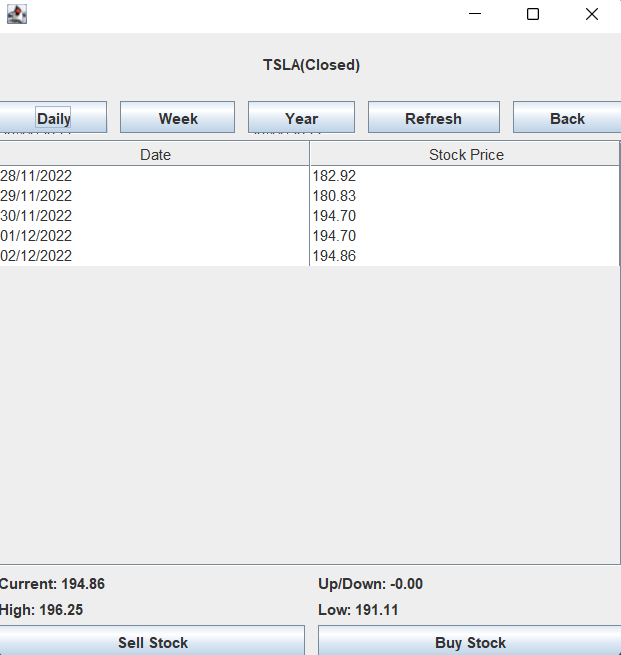
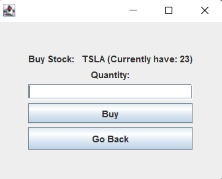
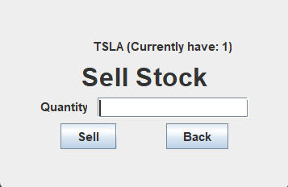
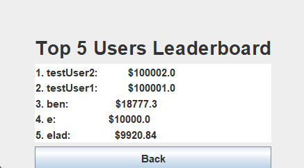

# Group Members:
- Inaam (Inaam2)
- Noel (noel-toms)
- Elad (eladperlman)
- Huy (huynguyen573))
- Elliot (Spaghetti-12)

## Stock Market Simulation

The Stock-market Simulator is a program that allows a user to simulate the environment of stock investments. It allows a user to register an account and then have the options to buy/sell/watchlist a stock and naturally develop multiple portfolios and an interest in the investment world! This also involves a competitive aspect such that each user can select a competitive portfolio which allows each user to put forward a portfolio which can compete with other user's portfolios. 

# Entities
## Leaderboard
Leaderboard is a list of competitive portfolios that are ranked by their total value.
Contains attributes:
- int SIZE 
- Map<User, Double> topUsers
## Portfolio
The portfolio class stores the portfolios of each user
Contains attributes:
- String name
- String username
- Map symbolToStock (Maps from symbol name to stock object)
- StockFactory stockFactory
- iEntityDBGate dbGateway (To connect to database)

This entity provides the means to sell stocks, pull stocks and update stock values in the user's portfolio. 

## Portfolio Factory
The portfolio factory class is used to create portfolios for each user
## Stock
The stock class stores the stock information in the form of a Stock object.
Contains attributes:
- String symbol
- double value
- int quantity
- iEntityDBGateway dbGateway

## Stock Factory
The stock factory class is used to create stock objects 
## User
The user class stores the user information in the form of a User object.
Contains attributes:
- String username
- String password
- String email
- iEntityDBGateway dbGateway
- PortfolioFactory portfolioFactory
- Portfolio portfolio
- Map portfolioMap (Maps from portfolio name to portfolio object)
- Map symbolToStock (Maps from symbol name to stock object)
- StockFactory stockFactory
## User Factory
The user factory class is used to create user objects
## User Manager
The user manager class is used to manage the user objects
Contains attributes:
- iEntityDBGateway dbGateway
- UserFactory userFactory

# Use Cases

## Registration use case

This use case provides the interface to register a user with a username and password. This use case has the following functions:
- signUpUser() 
  - Takes in the username, password and password confirmation to check with the input data is suitable to be registered given that it passes certain conditions
- passwordValid()
  - Takes in the password and password confirmation and checks if it follows the necessary conditions of being a valid password. If it does, it will return True, otherwise False
- usernameValid()
  - Takes in the input username and checks if it follows the necessary conditions of being a valid username. If it does, it will return True, otherwise False
  
## Login use case

This use case provides the interface to log in to the user's account and access their portfolio(s). This use case has the following functions:
- loginUser()
  - Takes in username and password, and then returns the UserLoginResponse
- loginResult()
  - method in presenter class responsible for displaying weather login was successful based on the user
  - object given from the user manager, if it is null presenter invokes view's failed login method,
  - otherwise creates a new user presenter and closes current view

## Portfolio use case
This use case provides the interface to allow users to create new portfolios and allow users to enter into a portfolio and begin investing. This includes deciding on a competitive portfolio. This use case has the following functions:

- makeNewPortfolio()
  - Takes in the portfolio name, then check with the database if the name already existed. If not, create a new portfolio with that name and add it to the user's portfolio map and display a response to user
- populatePortfolio()
  - Takes in the user and portfolio name and then display the stocks in that portfolio
- makeCompPortfolio()
  - Takes in the user and then make that portfolio a competitive portfolio

## Search Stock use case
This use case provides the interface to allow users to search any stock and view it's stock price fluctuations over a varied period of time. This use case directly links to both sell and buy stock. This use case has the following functions:
- isValidStock()
  - Check with the API if the stock is valid. Throw an exception if it is not and tell the user to try again
- SearchStock()
  - Assigns the stock from the API to get the stock properties. This is different from isValidStock() as it has more parameters
  for the historical data and takes more time.
- GetHisData()
  - Get the historical data of the stock from the API
- SortHistoricalData()
  - Sort the historical data from the API into a list of dates and a list of prices
- GetStockValue()
  - Get the current stock price from the API

## Buy Stock use case
This use case provides the interface to allow users to buy a stock after having selected a stock in the search stock case. This use case has the following functions:
- buyStock()
  - Takes in the stock symbol, quantity and portfolio name, then check if the user's input is valid and user has enough balance. If the requirements are met, add the stock to portfolio and subtract the balance with stock's value and then display a response to user

## Sell Stock use case
This use case provides the interface to allow users to sell a stock after having selected a stock in the search stock case. This use case has the following functions:
- sellStock()
  - Takes in the stock symbol, quantity and portfolio name, then check if the user's input is valid and user has enough stock to sell. If the requirements are met, remove the input amount of the stock from portfolio and add the selling money to balance,then display a response to user

## Watchlist use case
This use case provides the interface to allow users to watchlist any stock and notify the user once the stock price has reached a desired price range. This use case has the following functions:

- addStockToWatchlist()
  - Takes in a stock symbol, value, a portfolio id and a condition (Above or Below), after verifying the stock is in the users portfolio and the value is a positive number it then adds the stock to the users watchlist and then it displays a message to the user that the item is successfully added to the watchlist.
- removeStockFromWatchlist()
  - Takes in a stock symbol, value, a portfolio id and a condition (Above or Below), after verifying the stock is in the users watchlist and all the values match it then removes the item from the watchlist and sends a notification to the user that it has been removed
- updateWatchlist() 
  - This is a backend function that every few minutes pulls each item in the watchlist and checks if the watchlist notification should trigger and if it should it sends that notification to the user

## Leaderboard use case
This use case provides the interface to allow users to view the leaderboard of the top competitive portfolios. This use case has the following functions:
- IndexMax()
  - Takes in a list of values and returns the index of the maximum value
- TopValue()
  - Return list of values of each of the users' competitive portfolio net values
- updateLeaderboard()
  - Return a Leaderboard with the top users according to the current value of their competitive portfolios

# GUI

Swing GUIs that require user input have a JTextField which in turn allows for users to input information into the program

## Registration GUI

## Login GUI

## User GUI

## Portfolio GUI

## Create Portfolio GUI

## Search Stock GUI

## Buy Stock GUI

## Sell Stock GUI

## Watchlist GUI

## Leaderboard GUI

